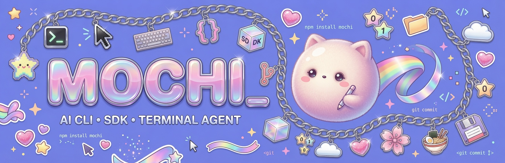

# Mochi — the fast, beautiful AI CLI, SDK, and terminal agent.

> Fast. Beautiful. Built for humans.
> A modular AI agent that lives in your terminal, a library you can embed in your own tools, and an animated UI that gets out of your way.

---

<p align="center">
<a href="https://github.com/xanstomper/mochi/blob/main/LICENSE.md"></a>
<a href="https://github.com/xanstomper/mochi/releases"></a>
<a href="https://github.com/xanstomper/mochi/actions"></a>
<a href="https://goreportcard.com/report/github.com/mochi/mochi"></a>
<a href="https://github.com/xanstomper/mochi/stargazers"></a>
</p>

<p align="center">
<a href="https://github.com/xanstomper/mochi"></a>
<a href="https://pkg.go.dev/github.com/mochi/mochi"></a>
<a href="https://discord.gg/mochi"></a>
<a href="https://twitter.com/mochi_cli"></a>
</p>

---

<p align="center">

</p>

<p align="center">
<em>AI CLI · SDK · Terminal Agent</em>
</p>

---

## What is Mochi?

**Mochi** is a terminal-native AI coding agent built in pure Go. It reads your codebase, executes tools through the Model Context Protocol (MCP), and persists every session in SQLite — all in a single compiled binary with a sub-50ms cold start and an animated Bubble Tea v2 TUI.

Mochi currently ships as three things in one repository:

1. **Terminal AI agent** (`mochi`) — interactive TUI with full tool access, multi-model routing, session persistence, a cell-based canvas renderer, animated status bar, streaming visualization, and gradient banner effects.
2. **Go SDK** (`github.com/mochi/mochi`) — importable packages for the LLM abstraction layer (via [Fantasy](https://github.com/charmbracelet/fantasy)), agent runtime, tool registry, pub/sub bus, TUI primitives, and durable message store. Build your own AI-powered tools or embed Mochi in a service.
3. **Rendering toolkit** (`internal/ui/canvas`, `internal/ui/statusbar`, `internal/ui/streamviz`, `internal/ui/banner`) — cell-based framebuffer with dirty-region tracking, double buffering, animated transitions, particle systems, HSV-cycling head runs, and gradient rendering. Usable outside the agent loop for any terminal UI.

Mochi is **provider-agnostic** — Anthropic, OpenAI, Gemini, Bedrock, Copilot, Hyper, MiniMax, Vercel, local Ollama, and any OpenAI-compatible endpoint. It is **extensible** — MCP servers, agent skills, lifecycle hooks, custom tools, and hot-swappable themes. And it is **fast** — one static binary, no interpreter runtime, no Node or Python dependency to start the agent.

---

## Why Mochi?

| Why | How |
|-----|-----|
| **Fast** | Single static Go binary, sub-50ms cold start, no Node/Python runtime. |
| **Beautiful** | Cell-based canvas renderer with double buffering, animated gradient status bar, token-by-token streaming visualization, and particle banner. |
| **Composable** | Every component — LLM client, tools, agent, pub/sub, TUI, memory store, scheduler — is a reusable Go package. |
| **Extensible** | MCP servers, agent skills, lifecycle hooks, custom tools, themes, and runtime skill management. |
| **Multi-provider** | Anthropic, OpenAI, Gemini, Bedrock, Copilot, Hyper, MiniMax, Vercel, and any OpenAI-compatible API. |
| **LSP-aware** | Auto-discovers `gopls`, `pyright`, `tsserver`, `rust-analyzer`, `clangd`, and more. Provides code intelligence to the agent. |
| **Cross-platform** | Builds for macOS, Linux, Windows, FreeBSD; runs on x86, arm64, and WASI. |
| **Persistent** | SQLite session log, durable message store, file tracker, long-term memory, cron scheduler, prompt history. |
| **Animated UI** | Cell-based canvas with dirty-region tracking, particle systems, smooth color transitions, gradient renders. |

---

## Installation

Mochi is distributed as a single static binary.

### macOS / Linux — Homebrew

```bash
brew install xanstomper/tap/mochi
mochi --version
```

### Windows — Scoop

```powershell
scoop bucket add xanstomper https://github.com/xanstomper/scoop-bucket
scoop install mochi
mochi --version
```

### Go install

Requires Go 1.26+.

```bash
go install github.com/mochi/mochi@latest
mochi --version
```

### npm

```bash
npm install -g @xanstomper/mochi
mochi --version
```

### Docker

```bash
docker run --rm -it -v "$PWD:/workspace" -v "$HOME/.mochi:/root/.mochi" ghcr.io/xanstomper/mochi:latest
```

### Pre-built binaries

Download for your platform from the [latest release](https://github.com/xanstomper/mochi/releases/latest).

| Platform | Architecture | File |
|----------|-------------|------|
| macOS | Apple Silicon (M1+) | `mochi-darwin-arm64.tar.gz` |
| macOS | Intel | `mochi-darwin-amd64.tar.gz` |
| Linux | x86_64 | `mochi-linux-amd64.tar.gz` |
| Linux | arm64 | `mochi-linux-arm64.tar.gz` |
| Linux | musl (static) | `mochi-linux-musl-amd64.tar.gz` |
| Windows | x86_64 | `mochi-windows-amd64.zip` |
| Windows | arm64 | `mochi-windows-arm64.zip` |
| FreeBSD | amd64 | `mochi-freebsd-amd64.tar.gz` |

---

## Quick start

```bash
# 1. Install mochi
brew install xanstomper/tap/mochi

# 2. Login with your provider
mochi login anthropic   # or: mochi login openai / mochi login gemini

# 3. Run in any project
cd ~/my-project
mochi
# TUI opens. Type your first prompt.
```

Project context is auto-loaded from `AGENTS.md`, `MOCHI.md`, `CLAUDE.md`, or `GEMINI.md` in the working directory.

### Example session

```text
$ mochi
╭─ mochi ───────────────────────────────────────────────╮
│ ✦ thinking... claude-3-5-sonnet tok: 1,234 230ms │
╰───────────────────────────────────────────────────────╯

› Refactor the auth module to use JWT and add tests.

● I'll start by exploring the auth code...
$ ls internal/auth/
auth.go auth_test.go middleware.go

● Reading auth.go to understand the current structure...
✓ Read 142 lines

● Here's the refactored implementation with JWT...
```

---

## Features

### AI Agent

- **Multi-provider LLM** — Anthropic, OpenAI, Gemini, Bedrock, Copilot, Hyper, MiniMax, Vercel, local Ollama, and any OpenAI-compatible endpoint. Model routing with automatic failover on 429/5xx.
- **Tool registry** — bash/shell execution, file edit/write/view, glob, grep, LSP diagnostics, MCP, web fetch, web search, file tracker, todos, references, multi-edit, system info, custom logger, memory, and skill management.
- **Auto-skill creation** — Successful multi-step tasks are automatically packaged into reusable skills and saved to `.agents/skills/<task-name>/SKILL.md` so the agent can re-apply the same approach in future sessions.
- **Auto-memory** — The agent detects cues ("remember that", "I prefer X", "project uses Y") and stores them as tagged facts in the durable memory store. Facts are automatically injected into subsequent system prompts.
- **Skill management** — Browse, inspect, and manage installed skills via `mochi skill`. Built-in skills are discoverable alongside user-installed skills from `.agents/skills/` and `.mochi/skills/`.
- **Multi-agent** — Named agents (e.g. `coder`, `task`) with their own system prompts and tool sets.
- **Background jobs** — `&` suffix runs shell commands in the background. Manage with `mochi extras` commands.
- **Hooks** — User-defined shell commands on lifecycle events (`PreToolUse`, `PostToolUse`, `Stop`, etc.) with structured JSON I/O. Compatible with both `MO` and `Claude Code` hook protocols.

### Terminal UI

- **Cell-based canvas** (`internal/ui/canvas`) — Double-buffered, dirty-region-tracking framebuffer. Only cells that changed are written to the terminal. On a 24x80 frame with 5% dirty cells, Mochi emits ~150 bytes of ANSI instead of 4KB.
- **Animated status bar** (`internal/ui/statusbar`) — Always-visible state indicator with smooth color transitions across 8 agent states, a token counter with thousands separators, latency readout, and cost-per-1K display.
- **Streaming visualization** (`internal/ui/streamviz`) — Real-time token-by-token type-on effect with an HSV-cycling head character, configurable pacing, and a gravity-based particle trail with word-wrap tracking.
- **Animated banner** (`internal/ui/banner`) — Gradient sweep cell reveal with falling particles, a gentle breathing idle effect, and the Mochi wordmark.
- **Hybrid rendering** — Screen-based via Ultraviolet for layout, string-based for sub-components, and canvas-based for the new high-performance animated layer.
- **Themes** — MochiPink (default), Tokyo Night, Dracula, Light, Monokai. Hot-swap at runtime with `Ctrl+T`.
- **Mouse + keyboard** — Full mouse support (drag, click, double-click, scroll wheel), vim-style and emacs-style keybindings.

### Memory & Persistence

- **Session log** — Every conversation persisted in SQLite (`MOCHI.db`) with full token counts, costs, and timing. Durable message store survives restarts.
- **Durable message service** (`internal/message/durable.go`) — Messages written through a transactional service with WAL-mode SQLite. No lost turns on crash.
- **Project memory** — Tagged key-value store accessed via `mochi extras memory`. The agent saves and recalls facts across sessions.
- **Cron scheduler** (`internal/scheduler/`) — SQLite-backed cron jobs with go-cron syntax. Manage with `mochi cron list`, `mochi cron add`, `mochi cron remove`.
- **Prompt history** — Fuzzy-searchable history with `Ctrl+R`.
- **File tracker** — Per-session record of every file the agent touched.

### Developer Experience

- **Sub-50ms cold start** — Pure Go, no runtime, single static binary, CGO disabled.
- **Tab completion** — Generated completion scripts for bash, zsh, fish, and PowerShell.
- **Telemetry opt-in** — PostHog integration for usage analytics. Off by default.
- **Configurable** — `~/.mochi/MOCHI.json` for global, `.mochi/MOCHI.json` for per-project.
- **Context files** — Auto-loads `AGENTS.md`, `MOCHI.md`, `CLAUDE.md`, `GEMINI.md` (and `.local` variants) from the working directory.
- **Profile mode** — `mochi --profile` enables CPU + memory profiling.

---

## Usage

### Interactive TUI

```bash
mochi                      # launch TUI in current directory
mochi --model gpt-4o       # use a specific model
mochi --profile            # with profiling enabled
mochi --debug              # with debug logging
```

### One-shot prompts

```bash
mochi run "explain this codebase"
mochi run "add unit tests for the auth module" --auto-apply
mochi run --no-tui "what is the type of foo?"
```

### Models

```bash
mochi models                           # list all available models
mochi models --provider anthropic       # filter by provider
mochi login anthropic                   # set API key
mochi login openai
mochi login gemini
```

### Sessions

```bash
mochi sessions            # list all sessions
mochi session <id>        # resume a session
mochi stats               # show usage statistics
```

### Memory

```bash
mochi extras memory list              # show all remembered facts
mochi extras memory add "editor" "neovim"
mochi extras memory search "auth"
```

### Cron scheduler

```bash
mochi cron list                     # show scheduled jobs
mochi cron add "0 */2 * * *" "run tests and report"
mochi cron remove <name>
```

### Skills

```bash
mochi skill list                   # show installed skills
```

### Swarm (multi-agent)

```bash
mochi swarm                        # launch multi-agent swarm mode
```

---

## Architecture

```
mochi
├── main.go                        # CLI entry point (cobra)
├── internal/
│   ├── agent/
│   │   ├── coordinator.go         # turn orchestration, skill + memory + auto-skill
│   │   ├── agent.go               # core agent loop, title generation, retry logic
│   │   ├── composer/              # structured prompt composition
│   │   ├── prompt/                # template-based prompt builder with context + skills + cost
│   │   ├── tools/                 # built-in tools
│   │   │   ├── bash.go            # shell execution + background jobs
│   │   │   ├── edit.go            # single-file edit
│   │   │   ├── multi_edit.go      # multi-file edit
│   │   │   ├── view.go / write.go # file read/write
│   │   │   ├── fetch.go           # web fetch
│   │   │   ├── glob.go            # ripgrep + doublestar search
│   │   │   ├── grep.go            # ripgrep grep
│   │   │   ├── mcp/               # Model Context Protocol client
│   │   │   ├── memory.go          # memory CRUD tool (store/recall/search)
│   │   │   └── skill_manage.go    # skill inspection tool
│   │   └── templates/             # coder.md.tpl, task.md.tpl (Go templates)
│   ├── app/
│   │   └── app.go                 # top-level wiring: DB, config, agents, LSP, MCP, memory, cron
│   ├── backend/                   # HTTP backend (dashboard / web UI)
│   ├── cmd/                       # CLI commands (root, run, login, models, sessions, extras, cron, skill, swarm)
│   ├── config/                    # config loading, provider resolution, model catalog
│   ├── db/                        # SQLite via sqlc + migrations
│   │   ├── migrations/            # schema migrations
│   │   └── *.sql.go               # generated query code
│   ├── hooks/                     # lifecycle hook engine (PreToolUse, PostToolUse, Stop)
│   ├── lsp/                       # LSP client manager, auto-discovery, on-demand startup
│   ├── memory/                    # SQLite-backed memory store + retrieval
│   ├── message/
│   │   ├── service.go             # in-memory message service
│   │   └── durable.go             # SQLite-backed durable message service
│   ├── scheduler/                 # SQLite-backed cron scheduler
│   ├── session/                   # session CRUD (SQLite)
│   ├── skills/                    # skill discovery, deduplication, filtering, curation
│   ├── swarm/                     # multi-agent orchestration
│   ├── sdk/                       # reusable Go SDK packages
│   ├── shell/                     # bash execution + background jobs
│   ├── event/                     # PostHog telemetry
│   ├── pubsub/                    # internal pub/sub bus (decoupled agent ↔ UI)
│   ├── filetracker/               # per-session file tracking
│   ├── history/                   # fuzzy-searchable prompt history
│   ├── permission/                # tool permission checks and allow-lists
│   └── ui/                        # Bubble Tea v2 TUI
│       ├── canvas/              # ⭐ cell-based framebuffer + dirty-region rendering
│       ├── statusbar/           # ⭐ animated gradient status bar
│       ├── streamviz/           # ⭐ streaming visualization (type-on + particles)
│       ├── banner/              # ⭐ animated banner (gradient + particles)
│       ├── demo/                # interactive demo of all UI components
│       ├── anim/                # animated spinner
│       ├── chat/                # chat message renderers
│       ├── dialog/              # modal dialogs
│       ├── completions/         # autocomplete
│       ├── styles/              # all style definitions + themes
│       └── ...
└── docs/                          # documentation + assets
```

### Data flow

```
┌──────────────────────────────────────┐
│  LLM PROVIDER (any)                  │
│  Anthropic · OpenAI · Gemini · ...   │
└──────────────┬───────────────────────┘
               │ streaming tokens
┌──────────────▼───────────────────────┐
│  AGENT RUNTIME                       │
│  SessionAgent + Coordinator          │
│  tools · hooks · skills · MCP        │
│  memory · scheduler · auto-skill     │
└──────────────┬───────────────────────┘
               │ pubsub.Event[T]
┌──────────────▼───────────────────────┐
│  UI LAYER                            │
│  Bubble Tea v2 + Ultraviolet         │
│  canvas · statusbar · streamviz      │
│  banner · chat · dialog              │
└──────────────┬───────────────────────┘
               │ ANSI escape sequences
┌──────────────▼───────────────────────┐
│  TERMINAL                            │
│  (any UTF-8, xterm-256color, true)   │
└──────────────────────────────────────┘
```

### Persistence layer

```
MOCHI.db (SQLite, WAL mode)
├── sessions          — conversation metadata, token counts, cost, timestamps
├── messages          — full message log (role, parts, model, provider, timing)
├── files             — cached file content per session with version tracking
├── read_files        — file read audit trail
├── memories          — tagged key-value memory store (fact, preference, project)
├── cron_jobs         — scheduled task definitions + run history
└── goose_db_version  — schema migration tracking
```

---

## What's new in this branch

The working tree at `C:\Users\Ben\workspace\mochi` contains an extended Mochi codebase beyond the released v0.4.0. The new systems are fully wired into the agent loop and TUI.

### Auto-skill creation

When the agent successfully completes a multi-step task, `processAutoSkill` ("coordinator.go:312") extracts a kebab-case name from the prompt, packages the approach into a SKILL.md file, and writes it to `.agents/skills/<task-name>/`. The skill is immediately available for future sessions. Generic verbs ("build", "create", "fix") are skipped to avoid noise.

### Auto-memory

`processAutoMemory` ("coordinator.go:312") detects user cues and persists them automatically:

- **Explicit cues** — "remember that X", "note that Y", "important: Z"
- **Preferences** — "I prefer X", "don't use Y", "always use Z"
- **Project facts** — "project uses X", "built with Y"

Memories are stored with importance weighting (high for explicit cues, medium for preferences and project facts) and injected into the system prompt at agent build time.

### Durable message store

`internal/message/durable.go` replaces the in-memory message service with a SQLite-backed transactional service. Every message is written through WAL-mode SQLite with proper `finished_at` timestamps. Crash recovery: if the agent dies mid-turn, the durable store preserves the partial transcript and the session can be resumed.

### Cron scheduler

`internal/scheduler/` uses SQLite to persist scheduled jobs. Jobs run on a go-cron ticker and can fire prompts to the agent on a schedule. Managed via `mochi cron list`, `mochi cron add`, `mochi cron remove`.

### Skill management

`mochi skill` exposes full CRUD for agent skills from the CLI. `tools/skill_manage.go` provides a tool the agent can call to inspect, enable, or disable installed skills during a session.

### Memory store

`internal/memory/` provides a SQLite-backed key-value store with category tagging (fact, user preference, project), importance levels, and full-text retrieval. Accessed via the `memory` tool in the agent tool registry and via `mochi extras memory` from the CLI.

### Cost-aware prompts

`prompt.go` now injects per-model cost estimates (`CostPer1KIn`, `CostPer1KOut`) into the system prompt. The agent can see how much the current model costs per 1K tokens in both directions.

### Swarm mode

`internal/swarm/swarm.go` adds a basic multi-agent orchestration layer that can fan out tasks to named specialist agents.

---

## Comparison

| Feature | Mochi | Crush | OpenCode | Claude Code | Codex CLI |
|---------|:-----:|:-----:|:--------:|:-----------:|:---------:|
| Multi-provider LLM | ✓ | ✓ | ✓ | ✗ (Claude only) | ✓ |
| Single static binary | ✓ | ✓ | ✗ (Node) | ✗ (Node) | ✗ (Node) |
| LSP integration | ✓ | ✓ | ✓ | ✓ | ✗ |
| MCP servers | ✓ | ✓ | ✓ | ✓ | ✗ |
| Cell-based canvas renderer | ✓ | ✗ | ✗ | ✗ | ✗ |
| Animated status bar | ✓ | ✗ | ✗ | ✗ | ✗ |
| Streaming type-on effect | ✓ | ✗ | ✗ | ✗ | ✗ |
| Particle banner | ✓ | ✗ | ✗ | ✗ | ✗ |
| Auto-memory (cue-based) | ✓ | ✗ | ✗ | ✗ | ✗ |
| Auto-skill creation | ✓ | ✗ | ✗ | ✗ | ✗ |
| Durable message store | ✓ | ✗ | ✓ | ✗ | ✗ |
| Cron scheduler | ✓ | ✗ | ✗ | ✗ | ✗ |
| Hooks (PreToolUse etc.) | ✓ | ✗ | ✓ | ✓ | ✗ |
| SQLite session log | ✓ | ✓ | ✓ | ✗ | ✗ |
| Cross-platform static | ✓ | ✓ | ✗ | ✗ | ✗ |
| Open source | ✓ | ✓ | ✓ | ✗ | ✓ (Apache) |
| Themes | ✓ | ✓ | ✓ | ✗ | ✗ |
| **Cold start** | **< 50ms** | ~80ms | ~600ms | ~900ms | ~500ms |

> Benchmark: `time mochi --version` on macOS M2, 2024. "Cold start" excludes shell startup, includes Go runtime init.

---

## Performance

Mochi is fast. Here is how it achieves sub-50ms cold start and smooth 60fps rendering:

- **No Node, no Python, no runtime.** Pure Go, single static binary, CGO disabled. No interpreter startup overhead.
- **Cell-based canvas renderer.** Only changed cells are written to the terminal. A 24x80 frame with 5% dirty cells emits ~150 bytes of ANSI, not 4KB. Dirty-region tracking + double buffering eliminate redundant writes.
- **Async streaming.** The agent returns a `tea.Cmd` for every async operation. The render loop never blocks on I/O.
- **Lazy list rendering.** The chat list only renders visible items. A 10,000-message session scrolls at 60fps.
- **Pre-rendered spinner frames.** The animated spinner pre-renders 10 frames at init time. The render loop is a slice lookup.
- **Connection pooling.** HTTP/2 with keepalive for all LLM providers. No reconnect cost between requests.

Run the benchmark yourself:

```bash
mochi bench   # renders 1000 frames, reports FPS + memory
```

---

## Configuration

Mochi is configured via `MOCHI.json`. Locations (in order of precedence):

1. `./.mochi/MOCHI.json` (per-project)
2. `./MOCHI.json` (per-project, legacy)
3. `~/.mochi/MOCHI.json` (per-user)
4. `/etc/mochi/MOCHI.json` (system)

```json
{
  "$schema": "https://raw.githubusercontent.com/xanstomper/mochi/main/schema.json",
  "providers": {
    "anthropic": {
      "api_key": "sk-ant-...",
      "models": ["claude-3-5-sonnet-latest", "claude-3-5-haiku-latest"]
    },
    "openai": {
      "api_key": "sk-...",
      "models": ["gpt-4o", "gpt-4-turbo"]
    }
  },
  "default_provider": "anthropic",
  "default_model": "claude-3-5-sonnet-latest",
  "theme": "mochi-pink",
  "agents": {
    "coder": { "model": "claude-3-5-sonnet-latest" },
    "task":  { "model": "claude-3-5-haiku-latest" }
  },
  "hooks": {
    "PreToolUse": [
      { "command": "echo $TOOL_NAME | tee -a ~/.mochi/audit.log" }
    ]
  },
  "skills": [".mochi/skills/*"],
  "mcp_servers": {
    "github": {
      "command": "npx",
      "args": ["-y", "@modelcontextprotocol/server-github"]
    }
  }
}
```

---

## Themes

Mochi ships with five built-in themes:

| Theme | Background | Accent | Preview |
|-------|-----------|--------|---------|
| **MochiPink** (default) | `#1A1B26` | `#FF4D94` | soft pinks, deep background |
| **Tokyo Night** | `#1A1B27` | `#7AA2F7` | cool blues, focused, modern |
| **Dracula** | `#282A36` | `#BD93F9` | purples, classic |
| **Light** | `#FAFAFA` | `#0061A4` | clean, daytime |
| **Monokai** | `#272822` | `#F92672` | warm, high-contrast |

Switch themes at runtime: `Ctrl+T` opens the theme picker.

---

## Built with

Mochi builds on exceptional open-source projects:

- **[Go](https://go.dev/)** — compiled static binary, no runtime
- **[Charm](https://charm.land)** — [Bubble Tea](https://github.com/charmbracelet/bubbletea) (TUI framework), [Lip Gloss](https://github.com/charmbracelet/lipgloss) (styling), [Glamour](https://github.com/charmbracelet/glamour) (markdown), [Ultraviolet](https://github.com/charmbracelet/ultraviolet) (screen-based rendering), [Catwalk](https://github.com/charmbracelet/catwalk) (TUI snapshot testing)
- **[Fantasy](https://github.com/charmbracelet/fantasy)** — LLM provider abstraction layer (Anthropic, OpenAI, Gemini, etc.)
- **[Model Context Protocol](https://modelcontextprotocol.io)** — tool interoperability standard
- **[mitchellh/go-wordwrap](https://github.com/mitchellh/go-wordwrap)** + **[gobwas/glob](https://github.com/gobwas/glob)** — text and file pattern matching
- **[modernc.org/sqlite](https://modernc.org/sqlite/)** — pure-Go SQLite driver (no CGO)
- **[spf13/cobra](https://github.com/spf13/cobra)** — CLI framework
- **[PostHog](https://posthog.com/)** — optional telemetry (off by default)
- **[crush](https://github.com/charmbracelet/crush)** — the original terminal agent that Mochi forked from in v0.4.0

---

## Contributing

We love contributions. See [CONTRIBUTING.md](CONTRIBUTING.md) for the full guide.

Quick start:

```bash
git clone https://github.com/xanstomper/mochi
cd mochi
go test ./...
go run .
```

Before opening a PR:

- Run `task lint:fix` (or `gofumpt -w .`)
- Run `go test ./...`
- Add tests for new functionality
- Update [CHANGELOG.md](CHANGELOG.md)

---

## Acknowledgments

Mochi forked from [crush](https://github.com/charmbracelet/crush) by Charmbracelet, Inc. — the terminal agent that proved a Go-native coding agent with a beautiful TUI was possible. The core agent runtime, Bubble Tea TUI, LSP integration, MCP support, hook engine, and original tool set all trace back to that codebase. Mochi adds the cell-based canvas renderer, animated status bar, streaming visualization, banner, durable message store, memory system, cron scheduler, auto-skill creation, and the Go SDK on top of that foundation.

Separately:

- [Anthropic](https://anthropic.com) — Claude, the model family that inspired this project.
- [OpenAI](https://openai.com) — GPT-4, the original instruction-following LLM.
- [Google DeepMind](https://deepmind.google) — Gemini.
- [The MCP team](https://modelcontextprotocol.io) — for the tool interoperability standard.
- The Go community for the best programming language ever designed.

And special thanks to all [contributors](https://github.com/xanstomper/mochi/graphs/contributors) and [stargazers](https://github.com/xanstomper/mochi/stargazers).

---

## Roadmap

- [x] v0.1 — Core agent + TUI + 5 providers
- [x] v0.2 — MCP support + LSP integration
- [x] v0.3 — Hooks + skills + multi-agent
- [x] v0.4 — Cell-based canvas renderer + animated UI
- [x] v0.4.x — Durable message store, auto-skill, auto-memory, cron scheduler, skill management, swarm
- [ ] v0.5 — Voice input/output
- [ ] v0.6 — Plugin marketplace
- [ ] v0.7 — Web UI (terminal over HTTP)
- [ ] v0.8 — WASM build for browser
- [ ] v1.0 — Stable API + governance

See [ROADMAP.md](ROADMAP.md) for details.

---

## License

[Functional Source License v1.1, MIT Future License](LICENSE.md) — © 2026 mochi contributors.

This project uses the [FSL-1.1-MIT](https://fsl.software/) license: source-available now, automatically converting to MIT two years after each release. You can use, modify, and redistribute the code for any purpose, including commercial use; the only restriction is that you may not sell a competing product based on the source code itself until the MIT conversion date for that release.

Mochi builds on work originally released under the FSL-1.1-MIT license by Charmbracelet, Inc. as [crush](https://github.com/charmbracelet/crush). The `go.sum` and `go.mod` retain the original module path transition from `github.com/charmbracelet/mochi` to `github.com/mochi/mochi`.

---

<p align="center">

</p>

<p align="center">
Made with care by the mochi team.
</p>
