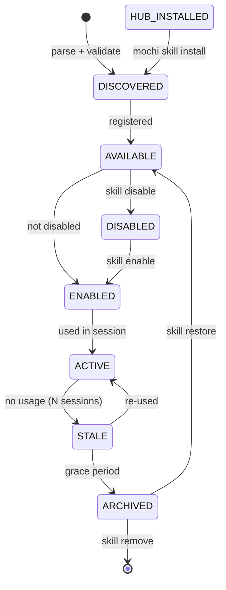

# MOCHI Skill System v2 — Design Document

> **Status:** Draft · **Target:** MOCHI v0.5+  
> **Authors:** MOCHI Engineering  
> **Supersedes:** The basic skill discovery system in `internal/skills/`

---

## Table of Contents

1. [Motivation & Goals](#1-motivation--goals)
2. [Conceptual Model](#2-conceptual-model)
3. [Skill Lifecycle State Machine](#3-skill-lifecycle-state-machine)
4. [File Format Changes (SKILL.md v2)](#4-file-format-changes-skillmd-v2)
5. [Directory Layout](#5-directory-layout)
6. [System Architecture](#6-system-architecture)
   - 6.1 [Core Package: `internal/skills/`](#61-core-package-internalskills)
   - 6.2 [Curator Service](#62-curator-service)
   - 6.3 [Hub Service](#63-hub-service)
   - 6.4 [Configuration Changes](#64-configuration-changes)
7. [CLI & TUI Commands](#7-cli--tui-commands)
8. [Implementation Roadmap](#8-implementation-roadmap)
9. [Backward Compatibility](#9-backward-compatibility)
10. [Open Questions](#10-open-questions)

---

## 1. Motivation & Goals

The current skill system is minimal: MOCHI discovers `SKILL.md` files at startup, parses YAML frontmatter, and injects them as XML into the system prompt. There is no versioning, no curation, no central registry, no enable/disable per project, and no way for users to discover or install skills from remote sources.

### Goals

| Goal | Priority | Why |
|------|----------|-----|
| **Skill versioning (semver)** | P0 | Track breaking changes; enable upgrade checks |
| **Skill lifecycle management** | P0 | Track usage, mark stale, auto-archive unused skills |
| **Per-project enable/disable** | P0 | Users need to control which skills apply to which project without editing a global list |
| **Skill hub (remote install)** | P1 | Install skills from GitHub repos, URLs, or a community registry |
| **TUI/CLI skill management commands** | P1 | List, inspect, enable, disable, install, update, remove skills interactively |
| **Curator (background maintenance)** | P2 | Auto-detect stale skills, suggest improvements, archive unused |

### Non-Goals

- A full plugin runtime (skill instructions remain markdown-for-LLM, not executable code)
- Binary skill distributions (skills remain file-based `SKILL.md` + optional assets)
- A curated community registry in this design (MVP: GitHub repos; registry comes later as a separate service)

---

## 2. Conceptual Model

```
┌────────────────────────────────────────────────────────────────────┐
│                         SKILL HUB (remote)                         │
│  GitHub repos · HTTP(S) URLs · Registry (future)                   │
└──────────────────────────┬─────────────────────────────────────────┘
                           │ install / update
                           ▼
┌────────────────────────────────────────────────────────────────────┐
│                    LOCAL SKILL STORE (filesystem)                   │
│                                                                     │
│  ┌──────────────┐  ┌──────────────┐  ┌──────────────┐              │
│  │  system/      │  │  user/       │  │  project/    │              │
│  │  (embedded)   │  │  (~/.mochi/  │  │  (.agents/   │              │
│  │               │  │   skills/)   │  │   skills/)   │              │
│  └──────┬───────┘  └──────┬───────┘  └──────┬───────┘              │
│         │                  │                  │                      │
│         └──────────────────┼──────────────────┘                      │
│                            ▼                                         │
│              ┌─────────────────────────┐                            │
│              │     SKILL CURATOR        │                            │
│              │  · usage tracking        │                            │
│              │  · staleness detection   │                            │
│              │  · archival              │                            │
│              └─────────────────────────┘                            │
└─────────────────────────────────────────────────────────────────────┘
                            │
                            ▼
              ┌─────────────────────────┐
              │    COORDINATOR           │
              │  · filter by project     │
              │  · inject into prompt    │
              │  · track loads           │
              └─────────────────────────┘
```

### Key Concepts

- **Skill Identity**: `name` (kebab-case, unique) — unchanged from v1. Identity is now version-qualified for display but the logical name remains the dedup key.
- **Skill Origin**: `builtin` (embedded), `user` (global data dir), `project` (workspace-local), `hub` (installed via hub). The origin determines upgrade policy and where `mochi skill install` puts it.
- **Skill State**: Each skill transitions through a lifecycle managed by the curator (see §3).
- **Skill Configuration**: Per-project overrides sit in `mochi.json` alongside global settings.

---

## 3. Skill Lifecycle State Machine

```
                  ┌──────────────────────────────────┐
                  │           DISCOVERED              │
                  │  (parsed, validated, registered)  │
                  └────────────┬─────────────────────┘
                               │
                               ▼
                  ┌──────────────────────────────────┐
                  │            AVAILABLE               │
                  │  tracked by curator, eligible     │
                  │  for prompt injection              │
                  └────────────┬─────────────────────┘
                               │
                    ┌──────────┴──────────┐
                    │                     │
                    ▼                     ▼
        ┌───────────────────┐  ┌───────────────────┐
        │     ENABLED        │  │    DISABLED        │
        │  (injected into    │  │  (not injected;    │
        │   prompt by        │  │   metadata still   │
        │   coordinator)     │  │   available)       │
        └─────────┬─────────┘  └─────────┬──────────┘
                  │                      │
                  │  (auto or manual)    │  (manual)
                  ▼                      │
        ┌───────────────────┐            │
        │   ACTIVE (used)    │            │
        │  (tracker shows    │            │
        │   recent load)     │            │
        └─────────┬─────────┘            │
                  │                      │
                  │  (curator detects    │
                  │   no usage for >N    │
                  │   sessions)          │
                  ▼                      │
        ┌───────────────────┐            │
        │     STALE          │◄──────────┘
        │  (usage below      │
        │   threshold;       │
        │   prompts user to  │
        │   archive/disable) │
        └─────────┬─────────┘
                  │
                  │  (curator archives
                  │   after grace period)
                  ▼
        ┌───────────────────┐
        │    ARCHIVED        │
        │  (moved to         │
        │   archive dir;     │
        │   removed from     │
        │   active set)      │
        └───────────────────┘
```

### State Transitions

| Transition | Trigger | Action |
|-----------|---------|--------|
| DISCOVERED → AVAILABLE | `discover()` completes | Skill added to manager's `allSkills` |
| AVAILABLE → ENABLED | Not in disabled list; not stale/archived | Included in `activeSkills` |
| AVAILABLE → DISABLED | User: `mochi skill disable <name>` | Added to project/global disabled list |
| DISABLED → ENABLED | User: `mochi skill enable <name>` | Removed from disabled list |
| ENABLED → ACTIVE | Tracker.MarkLoaded() called | Session logs usage |
| ACTIVE → STALE | Curator: no usage in N sessions | Flag set; user notification |
| STALE → ARCHIVED | Curator: grace period elapsed | Files moved to `archive/` |
| STALE → ACTIVE | Re-used by agent or user | Curator resets staleness counter |
| ARCHIVED → AVAILABLE | User: `mochi skill restore <name>` | Files moved back from `archive/` |
| ARCHIVED → (removed) | User: `mochi skill remove <name>` | Files deleted permanently |
| HUB → any | `mochi skill install <url>` | Files placed in skills dir |



---

## 4. File Format Changes (SKILL.md v2)

### Current (v1) format

```yaml
---
name: pdf-processing
description: Extracts text and tables from PDF files.
license: Apache-2.0
compatibility: Requires python 3.8+, pdfplumber
metadata:
  author: example-org
  version: "1.0"
---
# Instructions...
```

### New (v2) format

```yaml
---
name: pdf-processing
description: Extracts text and tables from PDF files.

# VERSIONING — new required field
version: 1.2.3              # semver (MAJOR.MINOR.PATCH)

# LIFECYCLE — new optional fields
lifecycle:
  status: stable             # experimental | stable | deprecated | archived
  introduced: 0.5.0          # mochi version that introduced this skill
  deprecation:
    message: "Use pdf-extract instead"
    suggested_replacement: pdf-extract
    effective: 0.7.0

# METADATA — extended
metadata:
  author: example-org
  author_url: https://github.com/example-org
  repository: https://github.com/example-org/mochi-skill-pdf
  license: Apache-2.0
  tags: [pdf, document, extraction]
  categories: [data-processing]
  min_mochi_version: 0.5.0  # minimum MOCHI version required
  icon: emoji:📄             # emoji or path to icon file relative to SKILL.md

# COMPATIBILITY — unchanged but now structured hint
compatibility: |
  Requires python 3.8+, pdfplumber ≥ 3.0

# INVOCATION — unchanged
user-invocable: true
disable-model-invocation: false
---
```

### Schema Changes

| Field | Type | Required | v1 compat | Notes |
|-------|------|----------|-----------|-------|
| `name` | string | yes | unchanged | kebab-case, max 64 chars |
| `description` | string | yes | unchanged | max 1024 chars |
| **`version`** | semver string | **yes (new)** | optional | MAJOR.MINOR.PATCH |
| **`lifecycle.status`** | enum | no | absent=v1 legacy, treated as "stable" | `experimental`, `stable`, `deprecated`, `archived` |
| **`lifecycle.introduced`** | semver string | no | absent | MOCHI version that shipped it |
| **`lifecycle.deprecation`** | object | no | absent | Only meaningful when status=deprecated |
| `metadata` | map | no | extended | New subfields: `repository`, `tags`, `categories`, `min_mochi_version`, `icon` |
| `metadata.repository` | URL | no | absent | Used by hub for upgrade checks |
| `metadata.tags` | []string | no | absent | For discovery/categorization |
| `metadata.categories` | []string | no | absent | `data-processing`, `devops`, `coding`, `writing`, etc. |
| `metadata.min_mochi_version` | semver | no | absent | Refuse to load if MOCHI is too old |
| `metadata.icon` | string | no | absent | `emoji:📄` or path like `icon.png` |
| `license` | string | no | unchanged | |
| `compatibility` | string | no | unchanged | |
| `user-invocable` | bool | no | unchanged | |
| `disable-model-invocation` | bool | no | unchanged | |
| `instructions` | markdown | implicit | unchanged | Everything after the frontmatter |

### Backward Compatibility

- v1 skills without `version` will be treated as `version: 0.0.0` with lifecycle `"stable"` (legacy). A warning is logged.
- The `metadata.version` field (from v1) is supplanted by the top-level `version`. If both exist, the top-level wins.
- All v1 validation rules are preserved. v2 skills with a `version` field get extra validation (semver parse, lifecycle status enum check).

### Skill Assets Directory

Skills installed from a hub may include additional assets (icons, example files, schemas):

```
~/.mochi/skills/pdf-processing/
  SKILL.md
  assets/
    icon.png
    examples/
      sample.pdf
      extract-example.json
```

The `internal/skills` package provides `ReadAsset(name, assetPath string) ([]byte, error)` for tools that need to access skill-local files.

---

## 5. Directory Layout

### Discovery Paths (unchanged from v1)

MOCHI discovers skills from these paths (in ascending priority order):

1. **Builtin** — embedded via `//go:embed builtin/*` in `internal/skills/builtin/`
2. **Global user** — `~/.config/mochi/skills/` (XDG_CONFIG_HOME)
3. **Data dir** — `~/.local/share/mochi/skills/` (XDG_DATA_HOME, hub installs go here)
4. **Project-local** — `.agents/skills/`, `.mochi/skills/`, `.claude/skills/`, `.cursor/skills/`
5. **Explicit** — entries in `mochi.json` → `options.skills_paths`
6. **Hub installs** — placed in data dir `~/.local/share/mochi/skills/hub/`

### Archive Directory

```
~/.local/share/mochi/
  skills/
    hub/                        # skills installed from hub
      pdf-processing/
        SKILL.md
      ...
  skills-archive/               # curator-moved archived skills
    pdf-processing-2026-06-01/
      SKILL.md
    ...
```

---

## 6. System Architecture

### 6.1 Core Package: `internal/skills/`

The package already has solid foundations. The following changes are needed:

#### `Skill` struct — new fields

```go
type LifecycleStatus string

const (
    LifecycleExperimental LifecycleStatus = "experimental"
    LifecycleStable       LifecycleStatus = "stable"
    LifecycleDeprecated   LifecycleStatus = "deprecated"
    LifecycleArchived     LifecycleStatus = "archived"
)

type Deprecation struct {
    Message             string `yaml:"message" json:"message"`
    SuggestedReplacement string `yaml:"suggested_replacement" json:"suggested_replacement"`
    Effective           string `yaml:"effective" json:"effective"` // semver of mochi version
}

type Lifecycle struct {
    Status      LifecycleStatus `yaml:"status" json:"status"`
    Introduced  string          `yaml:"introduced" json:"introduced"` // mochi version semver
    Deprecation *Deprecation    `yaml:"deprecation,omitempty" json:"deprecation,omitempty"`
}

type ExtendedMetadata struct {
    Author           string   `yaml:"author,omitempty" json:"author,omitempty"`
    AuthorURL        string   `yaml:"author_url,omitempty" json:"author_url,omitempty"`
    Repository       string   `yaml:"repository,omitempty" json:"repository,omitempty"`
    License          string   `yaml:"license,omitempty" json:"license,omitempty"` // moved from top-level
    Tags             []string `yaml:"tags,omitempty" json:"tags,omitempty"`
    Categories       []string `yaml:"categories,omitempty" json:"categories,omitempty"`
    MinMochiVersion  string   `yaml:"min_mochi_version,omitempty" json:"min_mochi_version,omitempty"`
    Icon             string   `yaml:"icon,omitempty" json:"icon,omitempty"`
}

type Skill struct {
    Name                   string            `yaml:"name" json:"name"`
    Description            string            `yaml:"description" json:"description"`
    Version                string            `yaml:"version,omitempty" json:"version,omitempty"`       // NEW
    Lifecycle              *Lifecycle        `yaml:"lifecycle,omitempty" json:"lifecycle,omitempty"`   // NEW
    Meta                   *ExtendedMetadata `yaml:"metadata,omitempty" json:"metadata,omitempty"`     // CHANGED
    UserInvocable          bool              `yaml:"user-invocable" json:"user_invocable"`
    DisableModelInvocation bool              `yaml:"disable-model-invocation" json:"disable_model_invocation"`
    License                string            `yaml:"license,omitempty" json:"license,omitempty"`       // KEPT for v1 compat
    Compatibility          string            `yaml:"compatibility,omitempty" json:"compatibility,omitempty"`
    Instructions           string            `yaml:"-" json:"instructions"`
    Path                   string            `yaml:"-" json:"path"`
    SkillFilePath          string            `yaml:"-" json:"skill_file_path"`
    Builtin                bool              `yaml:"-" json:"builtin"`

    // Runtime state (not from file)
    LifecycleState LifecycleState `yaml:"-" json:"lifecycle_state"` // NEW: curator-managed
    EnabledIn      []string       `yaml:"-" json:"enabled_in"`      // NEW: projects where enabled (or ["*"])
    HubInstalled   bool           `yaml:"-" json:"hub_installed"`   // NEW: installed via hub
    LastUsed       time.Time      `yaml:"-" json:"last_used"`       // NEW: curator-tracked
    UsageCount     int            `yaml:"-" json:"usage_count"`     // NEW: curator-tracked
}
```

#### New validation rules

```go
func (s *Skill) Validate() error {
    // ... v1 validations preserved ...

    // v2 validations
    if s.Version != "" {
        if _, err := semver.Parse(s.Version); err != nil {
            errs = append(errs, fmt.Errorf("version %q is not valid semver: %w", s.Version, err))
        }
    }
    if s.Lifecycle != nil {
        switch s.Lifecycle.Status {
        case LifecycleExperimental, LifecycleStable, LifecycleDeprecated, LifecycleArchived:
            // valid
        case "":
            // absent = stable for backward compat
        default:
            errs = append(errs, fmt.Errorf("invalid lifecycle status: %q", s.Lifecycle.Status))
        }
        if s.Lifecycle.Deprecation != nil && s.Lifecycle.Status != LifecycleDeprecated {
            errs = append(errs, errors.New("deprecation info requires lifecycle.status=deprecated"))
        }
    }
    if s.Meta != nil && s.Meta.MinMochiVersion != "" {
        if _, err := semver.Parse(s.Meta.MinMochiVersion); err != nil {
            errs = append(errs, fmt.Errorf("min_mochi_version %q is not valid semver: %w", s.Meta.MinMochiVersion, err))
        }
    }
    return errors.Join(errs...)
}
```

#### `LifecycleState` — runtime enum

```go
type LifecycleState int
const (
    StateUnknown    LifecycleState = iota  // not yet evaluated
    StateFresh                             // just discovered, never used
    StateActive                            // used recently
    StateStale                             // not used in N sessions
    StateArchived                          // moved to archive dir
)
```

#### `Manager` — new methods

```go
type Manager struct {
    // ... existing fields ...

    // NEW
    curator        *Curator
    hub            *Hub
    hubSkillsDir   string     // ~/.local/share/mochi/skills/hub/
    archiveDir     string     // ~/.local/share/mochi/skills-archive/
    sessionCounter int        // incremented each turn, used by curator
}

// NEW: EnableSkill enables a skill by name for the current project.
func (m *Manager) EnableSkill(name string) error

// NEW: DisableSkill disables a skill by name for the current project.
func (m *Manager) DisableSkill(name string) error

// NEW: InstallSkill downloads and installs a skill from a hub URL.
func (m *Manager) InstallSkill(ctx context.Context, source string) (*Skill, error)

// NEW: RemoveSkill permanently deletes a skill and its assets.
func (m *Manager) RemoveSkill(name string) error

// NEW: InspectSkill returns full metadata for a named skill.
func (m *Manager) InspectSkill(name string) (*Skill, error)

// NEW: ArchiveSkill moves a skill to the archive directory.
func (m *Manager) ArchiveSkill(name string) error

// NEW: RestoreSkill moves a skill back from the archive.
func (m *Manager) RestoreSkill(name string) error

// NEW: ListHubSkills queries a remote registry (or GitHub) for available skills.
func (m *Manager) ListHubSkills(ctx context.Context, query string) ([]HubEntry, error)
```

### 6.2 Curator Service

The curator is a background service that monitors skill lifecycle. It lives in `internal/skills/curator.go`.

#### Design

```go
// Curator manages skill lifecycle: tracks usage, detects staleness,
// prompts archival, and suggests improvements.
type Curator struct {
    mu              sync.Mutex
    usageDB         *curatorUsageDB    // file-based JSON store
    cfg             CuratorConfig
    log             *slog.Logger
    improvementHooks []ImprovementHook
}

type CuratorConfig struct {
    // How many sessions without use before marking stale
    StalenessThreshold int `json:"staleness_threshold"` // default: 10

    // How many sessions stale before auto-archiving
    ArchiveGracePeriod int `json:"archive_grace_period"` // default: 20

    // Whether to auto-suggest improvements
    EnableSuggestions bool `json:"enable_suggestions"` // default: false
}

// RecordUsage bumps the usage counter for a skill in a session.
func (c *Curator) RecordUsage(skillName string)

// Evaluate returns the lifecycle state for a skill based on usage history.
func (c *Curator) Evaluate(skillName string) LifecycleState

// CollectStaleness returns all skills that have crossed the staleness threshold.
func (c *Curator) CollectStaleness() []string

// RunMaintenance performs a curator pass: marks stale, archives, logs report.
func (c *Curator) RunMaintenance(ctx context.Context) (*MaintenanceReport, error)
```

**File-based usage store** (`curatorUsageDB`):

```json
// ~/.local/share/mochi/curator/skill-usage.json
{
  "version": 1,
  "skills": {
    "pdf-processing": {
      "last_used": "2026-06-01T12:00:00Z",
      "usage_count": 42,
      "total_sessions_seen": 100,
      "lifecycle_state": "active",
      "stale_since": null,
      "archived_at": null
    }
  }
}
```

#### Curator run cycle

1. **On session start**: Coordinator calls `curator.RecordUsage()` for any skill loaded during the turn.
2. **On session end** (periodic, every 5 sessions): `curator.RunMaintenance()`:
   - Scans all tracked skills
   - If `usage_count / total_sessions_seen < 0.1` (used in <10% of sessions where it was available) AND `total_sessions_seen >= StalenessThreshold` → mark stale
   - If stale for > `ArchiveGracePeriod` sessions → auto-archive (move files to `skills-archive/`)
3. **On startup**: curator loads usage DB and rebuilds lifecycle states.

### 6.3 Hub Service

The hub service lives in `internal/skills/hub.go`. It provides the ability to install skills from remote sources.

#### Design

```go
// HubSource describes where a skill can be installed from.
type HubSource string

const (
    HubSourceGitHub  HubSource = "github"
    HubSourceURL     HubSource = "url"
    HubSourceFile    HubSource = "file"
)

// HubEntry is a search result from a hub query.
type HubEntry struct {
    Name        string   `json:"name"`
    Description string   `json:"description"`
    Version     string   `json:"version"`
    Source      string   `json:"source"`    // the URL/repo to install from
    Tags        []string `json:"tags"`
    Author      string   `json:"author"`
}

// Hub handles remote skill installation.
type Hub struct {
    installDir string   // ~/.local/share/mochi/skills/hub/
    httpClient *http.Client
}

// InstallFromGitHub installs a skill from a GitHub repo.
// Expected layout: .mochi-skills/<name>/SKILL.md or SKILL.md at repo root.
// Source format: github:owner/repo[/path][@tag]
func (h *Hub) InstallFromGitHub(ctx context.Context, source string) (*Skill, error)

// InstallFromURL installs a skill from a direct URL to a SKILL.md or archive.
// Source format: https://example.com/path/to/skill.tar.gz
func (h *Hub) InstallFromURL(ctx context.Context, url string) (*Skill, error)

// Update checks the remote repository for a newer version and upgrades.
func (h *Hub) Update(ctx context.Context, skill *Skill) (*Skill, bool, error)

// Search queries a known registry or GitHub for skills matching a query.
func (h *Hub) Search(ctx context.Context, query string, limit int) ([]HubEntry, error)

// ListInstalled returns all skills installed via hub.
func (h *Hub) ListInstalled() []*Skill
```

#### GitHub repo convention

For `mochi skill install github:owner/repo`:

1. Clone the repo to a temp dir (or download a tarball)
2. Look for `SKILL.md` at the repo root
3. Or look for `.mochi-skills/<name>/SKILL.md` (multi-skill repos)
4. Parse and validate
5. Copy to `~/.local/share/mochi/skills/hub/<name>/`
6. Register in manager. On subsequent `mochi skill update`, re-check the remote git tag (or default branch) for a newer `version` in frontmatter.

#### Registry (future)

A community registry at a well-known URL (`https://mochi-skills.dev`) would provide:

- Search API
- Verified publisher badges
- Download counts
- Review/rating

For the MVP, we only support `github:` and direct URL installs.

### 6.4 Configuration Changes

#### `mochi.json` — new fields under `options`

```json
{
  "options": {
    "skills_paths": ["./custom-skills"],

    "skills": {
      "disabled": ["mochi-config"],
      "enabled": ["pdf-processing"],

      "per_project": {
        "pdf-processing": {
          "enabled": true,
          "projects": ["./project-a", "./project-b"]
        }
      },

      "hub": {
        "auto_update": true,
        "allowed_sources": ["github", "url"]
      },

      "curator": {
        "staleness_threshold": 10,
        "archive_grace_period": 20,
        "enable_suggestions": false
      }
    }
  }
}
```

**Resolution order** for enable/disable (highest priority wins):

1. Project-local `mochi.json` → `skills.enabled` / `skills.disabled`
2. Project-local `mochi.json` → `options.skills.per_project.<name>.enabled`
3. Global `mochi.json` → `options.skills.enabled` / `options.skills.disabled`
4. Everything else → enabled by default

A skill is **active** only if:
- It is NOT in the resolved disabled list
- AND (the resolved enabled list is empty OR it IS in the resolved enabled list)
- AND its `lifecycle.status` is not `archived`
- AND its `metadata.min_mochi_version` (if set) ≤ current MOCHI version

#### Config struct changes

```go
type Options struct {
    // ... existing fields ...

    SkillsPath []string `json:"skills_paths,omitempty"` // unchanged

    // NEW — skill management config
    Skills SkillsConfig `json:"skills,omitempty"`
}

type SkillsConfig struct {
    Disabled    []string                 `json:"disabled,omitempty"`
    Enabled     []string                 `json:"enabled,omitempty"`
    PerProject  map[string]SkillOverride `json:"per_project,omitempty"`
    Hub         HubConfig                `json:"hub,omitempty"`
    Curator     CuratorConfig            `json:"curator,omitempty"`
}

type SkillOverride struct {
    Enabled  bool     `json:"enabled"`
    Projects []string `json:"projects,omitempty"` // empty = all projects
}

type HubConfig struct {
    AutoUpdate     bool     `json:"auto_update,omitempty"`
    AllowedSources []string `json:"allowed_sources,omitempty"`
}
```

---

## 7. CLI & TUI Commands

### 7.1 CLI Commands (`mochi skill`)

A new `skill` subcommand group added to the cobra command tree:

```
mochi skill
  list        List all discovered skills with state, version, source
  enable      Enable a skill for this project
  disable     Disable a skill for this project
  inspect     Show full skill metadata and files
  install     Install a skill from hub (GitHub/URL)
  remove      Permanently remove a skill
  update      Update an installed skill to latest version
  search      Search the skill hub for available skills
  archive     Archive a skill (curator action)
  restore     Restore a skill from archive
```

#### `mochi skill list`

```
$ mochi skill list

  NAME                VERSION   STATUS    SOURCE    LOADED
  ────                ───────   ──────    ──────    ──────
  mochi-config        0.1.0     active    builtin   ✓
  mochi-hooks         0.1.0     active    builtin
  jq                  0.1.0     active    builtin
  pdf-processing      1.2.3     active    hub       ✓
  docker-helper       0.5.0     stale     user
  database-tools      2.0.0     disabled  project

Flags:
  --project    Filter by current project
  --status     Filter by lifecycle state (active|stale|archived|disabled)
  --source     Filter by origin (builtin|user|project|hub)
  --json       JSON output
```

#### `mochi skill inspect <name>`

```
$ mochi skill inspect pdf-processing

  Name:        pdf-processing
  Version:     1.2.3
  Status:      active (stable)
  Source:      hub (github:example-org/mochi-skill-pdf)
  License:     Apache-2.0
  Author:      example-org
  Repository:  https://github.com/example-org/mochi-skill-pdf
  Categories:  data-processing
  Tags:        pdf, document, extraction

  Usage:       42 loads across 100 sessions
  Last used:   2026-06-01 (3 days ago)

  Description: Extracts text and tables from PDF files.

  Path:        ~/.local/share/mochi/skills/hub/pdf-processing/SKILL.md
  File size:   3.2 KB
  Token est:   800 tokens
```

#### `mochi skill install <source>`

```
$ mochi skill install github:example-org/mochi-skill-pdf

  ✓ Downloading mochi-skill-pdf from github:example-org/mochi-skill-pdf...
  ✓ Parsed SKILL.md (v1.2.3, lifecycle: stable)
  ✓ Installed to ~/.local/share/mochi/skills/hub/pdf-processing/
  ✓ Registered with workspace

  Run `mochi skill inspect pdf-processing` for details.

$ mochi skill install https://skills.example.com/docker-helper.tar.gz

  ✓ Downloaded and extracted (v0.5.0)
  ✓ Installed to ~/.local/share/mochi/skills/hub/docker-helper/
```

#### `mochi skill search <query>`

```
$ mochi skill search pdf

  NAME                VERSION   AUTHOR          SOURCE
  ────                ───────   ──────          ──────
  pdf-processing      1.2.3     example-org     github:example-org/mochi-skill-pdf
  pdf-merge           0.3.0     anna-dev        github:anna-dev/pdf-merge
  ocr-helper          2.1.0     ocr-labs        github:ocr-labs/mochi-ocr

  Tip: `mochi skill install <source>` to install a skill.
```

#### `mochi skill archive <name>` / `mochi skill restore <name>`

```
$ mochi skill archive old-skill

  ⚠ This skill has not been used in 15 sessions.
  → Moving to archive: ~/.local/share/mochi/skills-archive/old-skill-2026-06-04/
  ✓ Archived.

$ mochi skill restore old-skill

  ✓ Restored from archive to active skill directory.
```

#### `mochi skill update [name]`

```
$ mochi skill update pdf-processing

  ✓ Checking github:example-org/mochi-skill-pdf...
  ✓ Current: 1.2.3 → Latest: 1.3.0
  ✓ Updated SKILL.md and assets.

$ mochi skill update --all

  ✓ docker-helper: 0.5.0 → 0.6.0
  ✓ pdf-processing: up-to-date (1.2.3)
  ✓ mochi-config: builtin, no updates needed
```

### 7.2 TUI Integration

The existing skills status panel (in `internal/ui/model/skills.go`) gains interactive elements:

- **Skill status panel** in sidebar: Shows count of enabled/disabled/stale skills
- **Click on a skill** → opens skill inspector overlay with version, status, usage stats
- **Right-click / context menu** → enable, disable, inspect, archive
- **Command palette** entries:
  - `skill:install` — prompts for GitHub/URL
  - `skill:list` — opens filterable skill browser
  - `skill:enable <name>` / `skill:disable <name>` — quick toggle

### 7.3 Implementation: new `internal/cmd/skill.go`

A new file `internal/cmd/skill.go` with cobra commands:

```go
var skillCmd = &cobra.Command{
    Use:   "skill",
    Short: "Manage MOCHI skills",
}

var skillListCmd = &cobra.Command{Use: "list", RunE: runSkillList}
var skillEnableCmd = &cobra.Command{Use: "enable", RunE: runSkillEnable}
var skillDisableCmd = &cobra.Command{Use: "disable", RunE: runSkillDisable}
var skillInspectCmd = &cobra.Command{Use: "inspect", RunE: runSkillInspect}
var skillInstallCmd = &cobra.Command{Use: "install", RunE: runSkillInstall}
var skillRemoveCmd = &cobra.Command{Use: "remove", RunE: runSkillRemove}
var skillUpdateCmd = &cobra.Command{Use: "update", RunE: runSkillUpdate}
var skillSearchCmd = &cobra.Command{Use: "search", RunE: runSkillSearch}
var skillArchiveCmd = &cobra.Command{Use: "archive", RunE: runSkillArchive}
var skillRestoreCmd = &cobra.Command{Use: "restore", RunE: runSkillRestore}

func init() {
    rootCmd.AddCommand(skillCmd)
    skillCmd.AddCommand(
        skillListCmd, skillEnableCmd, skillDisableCmd,
        skillInspectCmd, skillInstallCmd, skillRemoveCmd,
        skillUpdateCmd, skillSearchCmd, skillArchiveCmd,
        skillRestoreCmd,
    )
}
```

Each command connects through the workspace's `skills.Manager`, which is accessible from `app.App` and the `config.ConfigStore`. The backend and client modes also expose these operations via the existing proto/SSE event mechanism.

---

## 8. Implementation Roadmap

### Phase 1: Core plumbing (week 1-2) — P0

| Item | Files | Effort |
|------|-------|--------|
| Extend `Skill` struct with version, lifecycle, extended metadata | `internal/skills/skills.go` | S |
| Update `Validate()` with v2 rules | `internal/skills/skills.go` | S |
| Update `ParseContent` to handle new frontmatter fields | `internal/skills/skills.go` | S |
| semver dependency (use `golang.org/x/mod/semver` — already in Go std lib path) | `go.mod` | S |
| Add `LifecycleState` enum | `internal/skills/skills.go` | XS |
| Update `ToPromptXML` to include version and lifecycle info | `internal/skills/skills.go` | XS |
| Update tests | `internal/skills/skills_test.go` | M |

### Phase 2: Skills config and per-project control (week 2-3) — P0

| Item | Files | Effort |
|------|-------|--------|
| Add `SkillsConfig` to config struct | `internal/config/config.go` | S |
| Update schema.json | `schema.json` | S |
| Implement resolution order (global → project → per-skill) | `internal/skills/manager.go` | M |
| Add `EnableSkill`/`DisableSkill` to Manager | `internal/skills/manager.go` | S |
| Wire per-project override into `DiscoverFromConfig` and coordinator | `internal/skills/manager.go`, `internal/agent/coordinator.go` | M |

### Phase 3: Curator service (week 3-4) — P2

| Item | Files | Effort |
|------|-------|--------|
| Write `curator.go` with usage tracking (file-based JSON) | `internal/skills/curator.go` | M |
| Implement staleness detection | `internal/skills/curator.go` | M |
| Implement auto-archive | `internal/skills/curator.go` | M |
| Wire `curator.RecordUsage` into coordinator's skill tracker flow | `internal/agent/coordinator.go` | S |
| Wire `curator.RunMaintenance` into app lifecycle (periodic goroutine) | `internal/app/app.go` | S |
| Add curator config to `SkillsConfig` | `internal/config/config.go` | XS |

### Phase 4: Hub service (week 4-5) — P1

| Item | Files | Effort |
|------|-------|--------|
| Write `hub.go` with `InstallFromGitHub`, `InstallFromURL`, `Update`, `Search` | `internal/skills/hub.go` | L |
| GitHub tarball download + extraction | `internal/skills/hub.go` | M |
| Version comparison for updates | `internal/skills/hub.go` | S |
| Hub storage layout in data dir | `internal/skills/hub.go` | S |
| Add `HubConfig` to `SkillsConfig` | `internal/config/config.go` | XS |
| Wire hub dir into discovery paths | `internal/skills/manager.go` | S |

### Phase 5: CLI commands (week 5-6) — P1

| Item | Files | Effort |
|------|-------|--------|
| Create `internal/cmd/skill.go` with all subcommands | `internal/cmd/skill.go` | L |
| Implement `skill list` with filtering | `internal/cmd/skill.go` | M |
| Implement `skill inspect` | `internal/cmd/skill.go` | S |
| Implement `skill enable/disable` | `internal/cmd/skill.go` | S |
| Implement `skill install/remove/update` | `internal/cmd/skill.go` | M |
| Implement `skill search` | `internal/cmd/skill.go` | M |
| Implement `skill archive/restore` | `internal/cmd/skill.go` | S |
| Add new commands to root command tree | `internal/cmd/root.go` | XS |

### Phase 6: TUI integration (week 6-7) — P1

| Item | Files | Effort |
|------|-------|--------|
| Interactive skill list panel in sidebar | `internal/ui/model/skills.go` | M |
| Skill inspector overlay (version, status, usage) | `internal/ui/model/skills.go` + new file | M |
| Click-to-toggle enable/disable | `internal/ui/model/skills.go` | S |
| Command palette entries for skill operations | `internal/ui/model/completions/palette.go` | S |
| Stale/archive notifications | `internal/ui/model/notifications.go` | S |

### Phase 7: Polish and docs (week 7-8)

| Item | Files | Effort |
|------|-------|--------|
| Update existing docs (SKILL.md format spec) | `docs/skills/` | S |
| Write hub usage guide | `docs/skills/hub.md` | S |
| Write curator behaviour guide | `docs/skills/curator.md` | S |
| End-to-end tests | `internal/skills/` tests | M |
| Backend isolation tests (hub installs per workspace) | `internal/backend/backend_skills_test.go` | M |

---

## 9. Backward Compatibility

### File format

- v1 skills without `version` field get `version: 0.0.0` and lifecycle `"stable"` automatically.
- The old `metadata.version` string field (informal) is ignored in favor of the top-level `version` semver field.
- The top-level `license` field is preserved; if both `metadata.license` and `license` exist, `license` wins.
- v1 skills that lack frontmatter entirely still error.

### Config

- The existing `disabled_skills` field (`[]string`) is kept. The new `skills.disabled` field (`[]string`) is checked first; if both are set, `skills.disabled` takes precedence with a warning log.
- `skills_paths` is unchanged. The hub adds its own internal path automatically.

### API (proto)

- The `SkillState` proto message (`internal/proto/skills.go`) gains optional `version` and `lifecycle_status` fields.
- New proto messages: `SkillDetail`, `HubEntry`, `SkillInstallRequest`.
- New SSE event types: `skill_install`, `skill_update`, `skill_archive`.

### CLI exit codes

- All new commands follow existing MOCHI conventions: 0=success, 1=user error, 2=system error.

---

## 10. Open Questions

1. **Hub discovery format**: Should `mochi skill search` query GitHub Code Search API, or should we maintain a lightweight registry index file in a well-known repo? The latter is more reliable but requires infrastructure. **Proposal for MVP**: query GitHub search for repos tagged `mochi-skill` or repos with `.mochi-skills/` directory and parse SKILL.md metadata for search results. A dedicated registry comes later.

2. **Hub update frequency**: Should `mochi skill update` be automatic on startup, on demand, or via a scheduler? **Proposal**: on-demand (`mochi skill update`) is MVP; `auto_update: true` in config triggers a background check on startup (every 24h max).

3. **Curator configuration location**: Does the curator config live in `mochi.json` (per-project) or in `~/.config/mochi/curator.json` (global)? **Proposal**: both — global config in the data dir, per-project overrides in `mochi.json` `skills.curator`.

4. **Archive data retention**: How long should archived skills be kept before permanent deletion? **Proposal**: keep indefinitely, user explicitly runs `mochi skill remove` for permanent deletion.

5. **Multiple skills per hub repo**: A GitHub repo might contain multiple skills under `.mochi-skills/<name>/`. Should `mochi skill install github:owner/repo` install all of them? **Proposal**: `github:owner/repo` installs all skills in the repo; `github:owner/repo/path/to/skill` installs a single one.

6. **Skill dependency**: Should a skill be able to declare dependencies on other skills? **Proposal**: not in this design. Dependencies add complexity and the skill model (markdown → LLM) doesn't warrant it yet.

7. **Improvement suggestions**: What format should curator improvement suggestions take? **Proposal**: a plugin-like hook `ImprovementHook` interface that external code can register. Built-in hooks include: "missing version", "description too vague", "outdated compatibility info".
