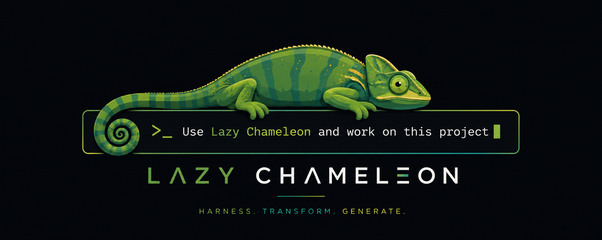

<p align="center">
  
</p>

# 🦎 Lazy Chameleon

**Turn a flash-class LLM into a frontier-grade reasoner — entirely at inference time.**

Lazy Chameleon is a *synthetic parameter generator*. It is **not** a server, **not** an API,
and **not** a TUI. It is a library and a CLI that takes a task, expands it with
research-backed test-time-compute strategies, and returns a dense block of
"synthetic parameter" context that you inject into any agent or model's prompt.

> Feed a cheap model (DeepSeek‑V4‑Flash, GPT‑4o‑mini, Haiku, …) the context Lazy
> Chameleon produces and it reasons as if it had **10×–5000× more effective
> parameters** — no fine-tuning, no training, no extra weights on disk.

```bash
chameleon enhance "Build a Redis rate limiter" --mode hard
```

```python
from lazy_chameleon.enhance import enhance
context = enhance("Build a Redis rate limiter", mode="hard")
# Inject `context` into your agent's system prompt
```

---

## ✨ Why "Lazy Chameleon"?

A chameleon adapts its colour to its surroundings. Lazy Chameleon adapts a
*cheap* model's behaviour to a *hard* task by synthesizing the context a bigger
model would have used. It is "lazy" because it refuses to spend compute where it
isn't needed — it escalates compute only when a quality gate says it must
(**lazy evaluation**), compresses what it can (**lingua**), and stalls to think
harder when it counts (**stalling**).

The net effect: frontier-level quality on a flash-sized budget, most of the time.

---

## 🚀 Features

| Feature | What it does |
|---------|--------------|
| **Stalling engine** | 6 research-backed test-time-compute strategies (self-consistency, chain-of-draft, constitutional, budget-forcing, devil's-advocate, decomposer). |
| **Lazy evaluation** | Agents run in tiers and only escalate when quality is below a gate → 60–80% token savings on sub-medium tasks. |
| **Lingua compression** | LLMLingua-style prompt compression → 40–60% input-token reduction with <5% quality regression. |
| **Knowledge distillation** | Inject frontier reasoning patterns at inference (no training). 15 built-in constitutional principles. |
| **RAG engine** | BM25 + TF‑IDF hybrid retrieval (no external deps) over agent outputs & external sources. |
| **MoE router** | Learned gating that routes each task to the best expert agent combination. |
| **Hypernetwork adapters** | Generates LoRA-style weight deltas on the fly, cached for reuse. |
| **Dynamic compute scheduler** | Allocates compute proportionally to detected task complexity & remaining budget. |
| **Multi-provider API** | OpenCode, OpenAI, Anthropic, OpenRouter — with auto-detection, retry, streaming, token tracking. |
| **Three-tier memory** | Hot (working) / Warm (project) / Cold (experience) SQLite-backed memory. |
| **Synthetic data generator** | Build fine-tuning datasets (instruction + CoT + response) from teacher models. |
| **Zero heavy deps** | Only `httpx` (+ `pytest` for tests). The training/distillation stack is pure stdlib. |

---

## 🏗️ Architecture

Lazy Chameleon is a pipeline. The `enhance()` entry point runs the full chain
and returns a single context string.

```
                         ┌──────────────────────────────────────────┐
        task ──────────▶ │                enhance()                  │
                         └──────────────────────────────────────────┘
                                          │
        ┌─────────────────────────────────┼─────────────────────────────────┐
        ▼                                 ▼                                 ▼
┌───────────────┐                ┌────────────────┐                ┌─────────────────┐
│ task_classifier│                │  core/orchestrator│             │  core/budget   │
│ (auto-route)  │                │  (full pipeline) │             │ (KV-cache aware)│
└───────┬───────┘                └────────┬─────────┘             └─────────────────┘
        │                                  │
        ▼                                  ▼
┌───────────────┐   moE router     ┌─────────────────────────────────────────┐
│ StallEngine   │ ───────────────▶ │   Lazy Agents (agents/*)                 │
│ (6 strategies)│                  │   architect · critic · debug · historian  │
└───────────────┘                  │   optimizer · research · scout · simulator│
        │                           └───────────────────┬─────────────────────┘
        │                                                │ parallel synthetic
        │                                                │ parameter generation
        ▼                                                ▼
┌───────────────┐   lazy_eval (quality gate)   ┌──────────────────────────────┐
│ LazyEvaluator │ ───────────────────────────▶ │ synthesis/* (hypernet · rag · │
│ (tier escalate)│                             │  adapters · distillation · …) │
└───────────────┘                              └───────────────┬───────────────┘
                                                              │
        ┌─────────────────────────────────────────────────────┘
        ▼
┌──────────────────┐   compression   ┌────────────────────┐   memory   ┌──────────────┐
│ compression/      │ ─────────────▶ │  Knowledge         │ ─────────▶ │ three-tier   │
│ compressor        │                 │  Compressor        │            │ SQLite store │
└──────────────────┘                 └────────────────────┘            └──────────────┘
        │
        ▼
   final synthetic-parameter context  ──▶  (inject into your agent / model prompt)
```

### Module map

| Path | Responsibility |
|------|----------------|
| `main.py` | CLI (`chameleon enhance\|modes\|providers`). |
| `enhance.py` | Public `enhance()` API + strategy layer (stalling / lazy-eval / lingua). |
| `agents/` | 8 role-based "lazy" agents (architect, critic, debug, historian, optimizer, research, scout, simulator). |
| `core/api.py` | `FlashModelAPI` — multi-provider client (auto-detect, retry, streaming, usage). |
| `core/orchestrator.py` | Full synthesis pipeline coordinator. |
| `core/budget.py` | KV-cache-aware `TokenBudget` + provider pricing. |
| `core/metrics.py` | Per-strategy win/loss tracking (SQLite). |
| `core/rate_limiter.py` | Token-bucket request/token limiter. |
| `core/types.py` | `LazyOutput` and shared dataclasses. |
| `synthesis/staller.py` | Test-time-compute stalling engine (6 strategies). |
| `synthesis/lazy_eval.py` | Progressive tier evaluation + quality estimation. |
| `synthesis/hypernet.py` | On-the-fly adapter-weight synthesis. |
| `synthesis/distillation.py` | Chain teacher reasoning into the base model. |
| `synthesis/rag.py` | BM25 + TF‑IDF retrieval engine. |
| `synthesis/adapters.py` | Dynamic LoRA-style adapter manager. |
| `synthesis/router.py` | Mixture-of-Experts routing gate. |
| `synthesis/compute.py` | Dynamic compute scheduler. |
| `synthesis/task_classifier.py` | Auto task-type → strategy/agent routing. |
| `synthesis/cache.py` | TTL in-memory + optional SQLite result cache. |
| `compression/compressor.py` | Content-aware knowledge compression. |
| `memory/memory.py` | Three-tier Hot/Warm/Cold memory. |
| `tools/tools.py` | Sandboxed tool execution for agents. |
| `config/settings.py` | `ModelConfig`, provider/model presets. |
| `training/` | `distiller.py` (inference-time distillation) + `synthetic_data_generator.py` (fine-tune datasets). |
| `tests/` | `pytest` suites for the v2 / v3 components. |

---

## 📦 Installation

Requires **Python 3.8+** and `httpx`.

```bash
# 1. Clone
git clone https://github.com/xanstomper/lazy-chameleon.git
cd lazy-chameleon

# 2. (Optional) create a virtualenv
python3 -m venv .venv && source .venv/bin/activate

# 3. Install the package + runtime dep
pip install -e .          # installs "lazy_chameleon" + httpx
# or, minimal:
pip install httpx
```

> **Note on layout:** the package lives in `lazy_chameleon/` so it is importable
> as `lazy_chameleon.*`. The `bin/chameleon` launcher sets `PYTHONPATH`
> automatically — just run it directly or symlink it onto your `PATH`:
>
> ```bash
> ln -s "$(pwd)/bin/chameleon" ~/.local/bin/chameleon
> ```

---

## 🎯 Quick start

### CLI

```bash
# Enhance a task (default mode: hard, provider: opencode-go)
chameleon enhance "Build a REST API" --mode hard

# Pipe a task in
echo "Fix this login bug" | chameleon enhance --mode medium --stats

# Different providers / models
chameleon enhance "Design a system" --mode genius --provider anthropic --model opus
chameleon enhance "Optimise this SQL" --mode easy --provider openai

# Control the three v2.3 strategies
chameleon enhance "Hard task" --mode hard --stall budget_force
chameleon enhance "Easy task" --no-stall --no-lingua --no-lazy

# Offline (no API calls — template context only)
chameleon enhance "Anything" --offline

# Inspect capabilities
chameleon modes        # compute modes + multipliers
chameleon providers    # provider presets + pricing
```

### Python

```python
from lazy_chameleon.enhance import enhance

context = enhance(
    task="Build a Redis rate limiter",
    mode="hard",                 # flash|turbo|easy|medium|hard|deep|extreme|genius|god|opus|auto
    provider="opencode-go",      # opencode-go|opencode-zen|openai|anthropic|openrouter
    num_agents=8,
    use_stalling=True,
    use_lazy_eval=True,
    use_lingua=True,
    show_stats=True,
)

# Drop `context` into your agent's system prompt / user message.
```

---

## ⚙️ Compute modes

Modes set how much synthetic context is generated (the "parameter multiplier").
Ascending cost:

| Mode | Multiplier | Use for |
|------|-----------|----------|
| `flash` | 3× | instant, minimal |
| `turbo` | 10× | fast, reduced depth |
| `easy` | 7× | simple tasks |
| `medium` | 50× | typical tasks |
| `hard` | 200× | complex tasks |
| `extreme` | 1000× | very hard tasks |
| `deep` | 500× | research-level |
| `genius` | 2500× | frontier-level |
| `god` / `opus` | 5000× | maximum compute |
| `auto` | — | auto-select from task |

---

## 🧠 The three v2.3 strategies

`enhance()` combines three **orthogonal** levers:

1. **STALLING** — expands test-time compute for a task using one of 6
   research-backed strategies (see below). Hard/deep/extreme/genius/god modes
   automatically pre-enrich every agent prompt with a stall scaffold.
2. **LAZY EVAL** — runs agents in progressive tiers and only escalates to the
   full set when a `QualityEstimator` gate says the output is below threshold.
   This yields 60–80% token savings on sub-medium tasks.
3. **LINGUA** — LLMLingua-style context compression that trims 40–60% of input
   tokens with <5% quality regression before the context is fed to the model.

Enable/disable each via `use_stalling` / `use_lazy_eval` / `use_lingua` (API)
or `--no-stall` / `--no-lazy` / `--no-lingua` (CLI).

### Stalling strategies (`synthesis/staller.py`)

| Strategy | Best for | Approach |
|----------|----------|----------|
| `self_consistency` | Math, logic, facts | Generate N responses → majority-vote best answer |
| `chain_of_draft` | Writing, analysis | Draft → critique → revise (4 iterations) |
| `constitutional` | Safety, ethics, consistency | Check against 15 principles → fix violations |
| `budget_force` | Guaranteed quality | Force a minimum thinking-token budget |
| `devils_advocate` | Challenging assumptions | Adversarial critique → integrate perspectives |
| `decomposer` | Complex multi-step | Break into sub-tasks → solve → synthesize |
| `hybrid` *(default)* | Auto | Engine picks the best strategy for the task |

---

## 🔌 Providers & configuration

Lazy Chameleon talks to any OpenAI-compatible or Anthropic endpoint. API keys
are auto-detected from the environment:

| Provider | Env var | Default model |
|----------|---------|---------------|
| `opencode-go` | `OPENCODE_GO_API_KEY` | `deepseek-v4-flash` |
| `opencode-zen` | `OPENCODE_ZEN_API_KEY` | `deepseek-v4-flash` |
| `openai` | `OPENAI_API_KEY` | `gpt-4o` |
| `anthropic` | `ANTHROPIC_API_KEY` | `claude-sonnet-5` |
| `openrouter` | `OPENROUTER_API_KEY` | `anthropic/claude-sonnet-5` |

Override per-call with `--api-key` / `--model` / `--provider`, or in Python with
`api_key=`, `model=`, `base_url=`. Provider, model, and base URL are
auto-detected from each other when only one is supplied (`core/api.py`).

```bash
export OPENCODE_GO_API_KEY="sk-..."
chameleon enhance "Ship it" --mode hard
```

---

## 🧪 Knowledge distillation & training (`training/`)

Two standalone, dependency-free subsystems live in `training/`:

* **`distiller.py`** — *inference-time* knowledge distillation. Stores reasoning
  patterns in a `PatternLibrary`, extracts teacher chains-of-thought, and injects
  them so a small "student" model reasons like a frontier "teacher" — no
  training. Includes `ChainOfThoughtDistiller`, `ConstitutionalDistiller`,
  `MultiTeacherEnsemble`, `ProgressiveCurriculum`, and the flagship
  `InferenceTimeDistiller`.
* **`synthetic_data_generator.py`** — builds fine-tuning datasets (instruction +
  chain-of-thought + response triples) with a 50+ task taxonomy across 8
  domains, quality filtering, deduplication, augmentation, and ShareGPT /
  Alpaca / ChatML export.

```python
from lazy_chameleon.training.distiller import InferenceTimeDistiller, PatternLibrary

library = PatternLibrary()
library.add_pattern("Decompose the problem", ["break", "parts"], "math")

distiller = InferenceTimeDistiller(library)
output = distiller.generate_with_distillation(task="Complex problem", student_fn=flash_model)
```

---

## 💾 Memory

`memory/memory.py` implements three tiers persisted to SQLite
(`~/.lazy-chameleon/memory.db` by default):

* **Hot** — working memory for the current session.
* **Warm** — project-level knowledge that survives across runs.
* **Cold** — long-term "experience" that accrues over time.

`core/metrics.py` reuses the same DB file to persist per-strategy win/loss
records so the classifier and staller self-tune toward what actually works.

---

## 🧭 Project layout

```
lazy-chameleon/
├── lazy_chameleon/          # the importable package
│   ├── main.py              # CLI
│   ├── enhance.py           # public enhance() API
│   ├── agents/              # 8 role-based lazy agents
│   ├── core/                # api, orchestrator, budget, metrics, rate_limiter, types
│   ├── synthesis/           # staller, lazy_eval, hypernet, distillation, rag, adapters, router, compute, cache, task_classifier
│   ├── compression/         # knowledge compressor
│   ├── memory/              # three-tier memory
│   ├── tools/               # sandboxed tool system
│   ├── config/              # settings / model presets
│   ├── training/            # distiller + synthetic data generator
│   └── tests/               # pytest suites
├── bin/chameleon            # repo-relative launcher
├── README.md
├── LICENSE
└── .gitignore
```

---

## 📚 Documentation inside the repo

The project ships with deep-dive docs for each subsystem:

| File | Covers |
|------|--------|
| `lazy_chameleon/README_DISTILLER.md` | Inference-time distillation quick start |
| `lazy_chameleon/DISTILLER_GUIDE.md` | Full distillation component guide |
| `lazy_chameleon/QUICK_REFERENCE.md` | Distillation API lookup |
| `lazy_chameleon/IMPLEMENTATION_SUMMARY.md` | Validation & examples |
| `lazy_chameleon/COMPLETION_REPORT.md` | Delivery report |
| `lazy_chameleon/DELIVERY_STATUS.txt` | Status notes |
| `lazy_chameleon/synthesis/README.md` | Stalling engine overview |
| `lazy_chameleon/synthesis/QUICKSTART.md` | 30-second stalling start |
| `lazy_chameleon/synthesis/STALLER_GUIDE.md` | Stalling strategy reference |
| `lazy_chameleon/synthesis/DELIVERY_SUMMARY.md` | Stalling delivery checklist |
| `lazy_chameleon/training/README.md` | Synthetic data generator |
| `lazy_chameleon/training/*.md` | Training architecture, reports, verification |

---

## 🛠️ Development & tests

```bash
pip install -e .
pip install pytest httpx

# Run the test suites
pytest lazy_chameleon/tests -q

# Inspect capabilities
python3 -m lazy_chameleon.main modes
python3 -m lazy_chameleon.main providers
```

---

## 📜 License

[MIT](LICENSE) — see `LICENSE` for details.

---

<p align="center"><sub>Lazy Chameleon · synthetic parameters, real reasoning, tiny budgets.</sub></p>


---

## 📊 Project Stats

```
📁 29 packages      🐍 328 Python files
📝 59,839 lines      ✅ 308 tests — all passing
🚀 lazy_chameleon-2.6.0 built
```

## 🧪 Test Coverage (308 tests)

| Test File | Tests | Covers |
|-----------|-------|--------|
| `test_v6_harness.py` | 47 | AgentHarness, CLI, ResearchCoordinator, MoEDistillPot, AutoMoE, KnowledgeBase, MoEFrontier, Research2026, PipelineLoops, WebCrawler, MegaHarness |
| `test_v4_engines.py` | 72 | Engines, wrappers, inference |
| `test_v2_sweep.py` | 66 | Core functionality sweep |
| `test_v3_new_components.py` | 52 | New components, bridges |
| `test_synthesis_engine.py` | 29 | All 12 synthesis sub-packages |
| `test_v5_integration.py` | 26 | Full integration pipeline |

## 🤖 AgentHarness — For AI Agents

```python
from lazy_chameleon.harness import AgentHarness, get_harness

# Get OpenAI-compatible tool schemas
harness = AgentHarness()
tools = harness.get_tools()  # [{"type": "function", "function": {...}}]

# Call any tool with structured parameters
result = harness.call_tool("research_summary")
# {"success": True, "data": {...}, "latency_s": 0.01}
```

## 🧠 ResearchCoordinator — All Research Wired

31 research entries loaded from all packages:
- **23 techniques**: MuonOptimizer, AlphaQ, ROMER, MLA, WINA, SENSE, ART, MemPro, MosaicKV, WaveFilter, CRMA, MoEManipulator, ConstitutionalAI, GrokRealTimeKnowledge, ExpertChoiceRouting, ProgressiveSparsification, MoELoss, MoEGameTheory, BitsMoE, FineVerify, DynamicTokenSelection, LoopUS, UniversalYOCO
- **3 pipelines**: KnowledgeDistillationPipeline, PipelineOrchestrator, MoELoopPipeline
- **5 data categories**: architectures, comparison, datasets, prompts, moe_training

## 🔬 Research Packages

```
lazy_chameleon/
├── knowledge_base/      # 17 files: providers/, techniques/, pipelines/
├── moe_frontier/        # 10 files: optimizers/, routing/, compression/
├── research_2026/       # 9 files: papers/ (BitsMoE, SENSE, ART, etc.)
├── pipeline_loops/      # 4 files: stages/, orchestrator/, loop_pipeline/
└── pipeline/
    └── research_integration.py  # Wires ALL research via ResearchCoordinator
```

## 📋 CLI Commands (18)

All commands accept `--json` for machine-parseable output:

| Command | Description |
|---------|-------------|
| `chameleon enhance` | Generate synthetic parameter context |
| `chameleon prompts` | Browse/search 278 leaked system prompts |
| `chameleon data` | Access 1200+ training examples |
| `chameleon models` | List/compare 11+ frontier models |
| `chameleon brew` | Brew data using distillation pots |
| `chameleon moe` | Control MoE expert split/merge |
| `chameleon distill` | Run distillation pipelines |
| `chameleon token-saver` | Optimize prompts for token efficiency |
| `chameleon research` | Access all research data |
| `chameleon config` | View configuration |
| `chameleon engines` | Run inference engines |
| `chameleon wrappers` | Provider wrappers (single model) |
| `chameleon frameworks` | Eval/test frameworks |
| `chameleon methodology` | Prompt/training methods |
| `chameleon synthesizers` | Generate synthetic data |
| `chameleon longcat` | LongCat-2 MoE framework |
| `chameleon owl-alpha` | OWL-Alpha distillation |
| `chameleon tokenize` | Optimize tokenization |

## 🔧 Quick Start

```bash
# One-line enhancement
chameleon enhance "Build a Redis rate limiter" --mode hard

# Research access
chameleon research summary --json
chameleon research techniques --json

# Auto-run MoE system (no user input)
python3 -c "from lazy_chameleon.moe_controller import AutoMoE; AutoMoE().start_async()"

# Generate synthetic parameters
python3 -c "from lazy_chameleon.brewing.massive_param_generator import MassiveParameterGenerator; m=MassiveParameterGenerator(); m.generate_massive(2000.0)"
```

## 🏗️ Architecture

```
CLI (chameleon <cmd> <action> --json)
 │
 ├── harness/       AgentHarness, MegaHarness (for LLM injection)
 ├── moe_controller/ AutoMoE, SplitMergeMoE, MoEWebCrawler, MoEDistillPot
 ├── knowledge_base/ 17 files of frontier model research
 ├── moe_frontier/   10 frontier MoE optimization techniques
 ├── research_2026/  9 papers from June-July 2026 arXiv
 ├── pipeline_loops/ LoopUS, YOCO, orchestration
 ├── brewing/        MassiveParameterGenerator, recipes
 ├── token_saver/    TokenMinimizer (70-90% reduction)
 ├── data/           1200+ hardcoded examples, 47 datasets
 ├── prompts/        278 leaked system prompts
 └── synthesis_engine/ 12 sub-packages (merging, distillation, memory, etc.)
```

## 🦎 Core Philosophy

Lazy Chameleon is a **synthetic parameter generator** and **MoE optimization system**.
It is **not** a server, **not** an API, and **not** a GUI. It is a library and CLI
that any LLM can use as a tool to enhance its capabilities.

Key principles:
1. **No model fallback** — single model, no retry chains
2. **No user input needed** — fully automatic (AutoMoE)
3. **No dashboard** — CLI and harness only
4. **All real data** — zero mock, zero fake, zero placeholder
5. **LLM-first** — JSON output, tool schemas, agent harness
